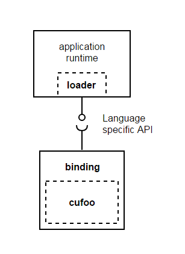
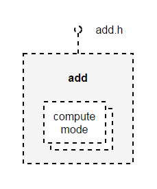
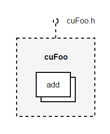
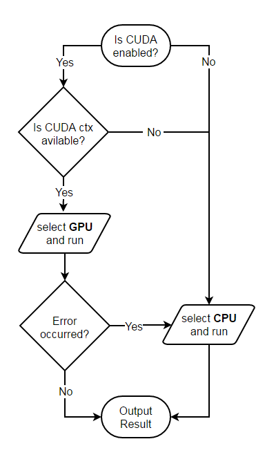

# __CUDA language bindings__ – with modern C++

#### By Raymond Glover - March 2017

_In this tutorial I explain the basics of writing cross-platform CUDA-enabled C++ extensions for Python/Node.js/Java applications, and introduce `kernel.h`, a miniature header-only utility for heterogeneous computing. The accompanying code for this tutorial is available here._

---

In building data-centric applications and the statistical models that underpin them, the ability to incorporate hardware accelerated algorithms is an [increasingly important](http://www.economist.com/news/business/21717430-success-nvidia-and-its-new-computing-chip-signals-rapid-change-it-architecture) consideration. This is especially true in cloud computing which is democratizing the data center, and with it the availability of dedicated compute appliances like GPUs and FPGAs.

In parallel to this, the use of C++ is becoming a de facto way among application developers to deliver core components targeting multiple underlying platforms. Whether it be for the desktop, mobile, embedded or cloud; C++ is a common denominator that can run practically anywhere without compromising on performance or flexibility.

With C/C++ acting as the enabling glue between data intensive/performance sensitive applications and the underlying hardware, it has become the catalyst for [heterogeneous computing](http://developer.amd.com/resources/heterogeneous-computing/what-is-heterogeneous-computing/) as it becomes mainstream.

#### Target Audience

This tutorial is aimed at application/framework developers considering extending their Python/node.js/Java applications with native subroutines, or adopting one of the many pre-existing libraries, but don't know where to start or what the landscape looks like.

In it, we'll construct a minimum working example of a native extension for 3 popular languages and identify some important aspects and principals to keep in mind when building your own bindings. I'll be assuming you have a basic understanding of C++, and at least one of the 3 target languages.

## Contents

- [Part 1 – Native Extensions](#Part1)
- [Part 2 – The Algorithm](#Part2)
- [Part 3 – Language Bindings](#Part3)
    - [Python](#Part3-1)
    - [Node.js (Javascript)](#Part3-2)
    - [Java](#Part3-3)
    - [Memory Management (in brief)](#Part3-4)
- [Summary](#summary)


<br>

# <a name="Part1"></a> Part 1 – Native Extensions

Lets outline what we're going to build. Imagine we have an application, and a crucial part of it is some computationally expensive algorithm. We've benchmarked the application and determined an implementation of this algorithm with a high-performance numerical library such as Eigen, cuBLAS or NPP is likely to be a worthwhile investment.

Our aim will be to construct this as a native extension, balancing performance, portability, and productivity. For lack of a better name, we'll call this extension `cufoo`.

Like many native extensions, there are three components to delivering `cufoo` for a target language:



__1. Loader__ – The language-specific interface to our extension. At a minimum it'll be responsible for finding and loading the extension itself. Whilst we want our extension to have a common API across all target languages, we also want it to feel idiomatic and ergonomic within the context of each. The loader is responsible for this.

__2. Extension (cufoo)__ – The core implementation of our algorithm(s), shared across all languages. 

__3. Binding__ – Acts as the interface between the extension and the target language runtime, describing the native extension through the target language's type system. In reality this will be a shared library (e.g. a `.dll` or `.so` file) accessible to the loader.

## Possible approaches

Before we get started, I'll skim over some common methods of integrating native libraries to other languages. I think you can  group each in to one of three categories:

__1. Raw C__ – Most modern languages provide a C interoperability layer or _foreign function interface_ (FFI). For all but the most trivial APIs, a C based integration would be both verbose and error prone. Even if we wrote a raw C integration, we'd find it hard to resist reinventing one of the other two approaches as we did so. The additional complexity of supporting multiple versions of the same language can also be (depending on the language) extremely burdensome, we'd want to avoid this.

__2. IDL bridges and generators__ – Popular examples include [SWIG](http://www.swig.org/) and the more nascent [djinni](https://github.com/dropbox/djinni). These bindings aim to abstract away the idiosyncrasies of individual languages by providing an _interface definition language_ (IDL) with which to define data structures and operations at the language boundary. The binding will try to figure out the rest, including how to [marshall](https://en.wikipedia.org/wiki/Marshalling_(computer_science)) data across this boundary, during an automated generation phase. As you'd imagine, the tradeoff in ease of use is the flexibility and internal complexity of such generators.

__3. IDL-like C++ wrappers__ – IDL-like wrappers are a middle ground between the first two approaches; by using techniques like [metaprogramming](https://en.wikipedia.org/wiki/Template_metaprogramming) and compile-time introspection (both features of C++) we can aim to build a language-specific wrapping mechanism that avoids the opaque abstractions in 2 and the boilerplate and incidental complexity of 1. Popular examples include [boost.python](http://www.boost.org/doc/libs/1_63_0/libs/python/doc/html/index.html) and [nan](https://github.com/nodejs/nan).

For a relatively simple extensions like `cufoo`, we could consider the convenience of method 2. However, it's not unrealistic to expect _real-world_ extensions to eventually encounter shortcomings with this approach, in particular when expressing parts of an API with idioms specific to a language, or idioms that differ slightly between languages; e.g. asynchronous callbacks, exceptions, or in dealing with the nuances of garbage collection.

This seems somewhat unavoidable; if you're using a mechanism that aims to hide the differences between two programming languages, then you also loose the ability to consider either one in isolation. To compensate, higher-level concepts are introduced in the binding itself, such as the [_typemaps_](http://www.swig.org/Doc2.0/Typemaps.html#Typemaps) or [_features_](http://www.swig.org/Doc2.0/Customization.html#Customization) mechanisms in SWIG. However, the added flexibility also introduces a new layer of complexity not readily understood by non-experts.

Instead, we'll use method 3, which I believe to be the most pragmatic. By exploiting the features of C++11/14, we'll build 3 lightweight wrappers to `cufoo` (one per language) in an IDL-like abstraction. In this way we can also enforce a strict separation of concerns between bindings, and so hope to keep our bindings simpler. We'll use three binding libraries that align with these aims:

- [pybind11](https://github.com/pybind/pybind11) (Python) – *Seamless operability between C++11 and Python*
- [v8pp](https://github.com/pmed/v8pp) (node.js) – *Bind C++ functions and classes into V8 JavaScript engine*
- [jni.hpp](https://github.com/mapbox/jni.hpp) (Java) – *A modern, type-safe, header-only, C++14 wrapper for JNI*

## The build system

In recent years, the tooling to develop complex cross-platform applications has significantly matured. Tools like [Bazel](https://bazel.build/), [Buck](https://buckbuild.com/) and [CMake](https://cmake.org/) orchestrate the building, testing, packaging and deployment for a variety of platforms and toolchains. The oldest and probably most widely used of these is CMake.

CMake is unusual (but not unique) in that it's really a _meta-build_ system used to _generate_ a build environment, rather than target build artifacts (executables and so on.) So for instance, on Windows, CMake can be used to generate a Visual Studio solution (an `.sln` file), whilst on Linux it's usually used to generate a Make based project (a `Makefile` file). CMake has support for many other build tools. Furthermore, the latest version of some IDEs and other productivity tools now have official support for CMake, making it available to a wider set of developers.

I've included a number of steps you can follow to complete this tutorial (although unfortunately they assume you're on Windows):

<br>

---

### __Step 1 –__ Install tools

- Install [CMake](https://cmake.org/download/).
- You'll also need a recent C++ compiler, for example Visual Studio 2015, gcc 5.4 or clang 3.8.

---

<br>

CMake has first-class support for C, C++, Objective-C and Fortran compilers, and extending CMake is certainly possible (and in some cases, preferable) to support other languages too. That being said, it's not the go-to tool for building and packaging _everything_. Integrations with Apache Maven (a Java build and package manager) and [Gradle](https://developer.android.com/ndk/guides/cmake.html#variables) (Android's integrated build system) can configure and drive CMake builds. This process is preferable when building complex packages for the respective platforms (e.g. `.apk` packages for Android), even if it sounds less convenient at first glance.

## Project structure

Here is what the complete directory structure for `cufoo` looks like:

```
.
├───include  . . . . . . . . . . . . . . . .  (1)
├───src
│   └───kernels  . . . . . . . . . . . . . .  (2)
├───third_party
│    └───gsl_lite  . . . . . . . . . . . . .  (3)
├───cmake  . . . . . . . . . . . . . . . . .  (4)
└───bindings
    ├───nodejs   . . . . . . . . . . . . . .  (5)
    │   ├───cmake  . . . . . . . . . . . . .  (4)
    │   ├───cufoo
    │   └───third_party
    │       └───v8pp . . . . . . . . . . . .  (3)
    │
    ├───python   . . . . . . . . . . . . . .  (5)
    │   ├───cufoo
    │   └───thirdparty
    │       └───pybind11 . . . . . . . . . .  (3)
    │
    └───java   . . . . . . . . . . . . . . .  (5)
        ├───src
        │   ├───main
        │   └───test
        └───third_party
            └───jni.hpp  . . . . . . . . . .  (3)
```

1. Contains the public interface for `cufoo`
2. Kernel definitions
3. Third party header-only libraries
4. Build helpers
5. Binding implementations

The core implementation resides in `src`, and each individual binding resides within `bindings`. Third-party libraries are placed as descendants to their dependant component(s).

Each binding is structured in a way considered idiomatic in the respective language. This is relevant for languages that require packages, modules, or source files to be arranged in a certain way in the file system.

<br>

# <a name="Part2"></a> Part 2. The algorithm


The `src/kernels` folder contains our algorithm. The term _kernel_ is used to describe a low-level building block which facilitates some higher-level algorithm or subroutine. A kernel may be invoked directly by a consumer of your library or rather via some higher-level public API. There can be several kernel implementations for the same logical operation; it's the job of our library to select one based on the inputs to the operation and the capabilities of the underlying hardware.

For `cufoo` our single kernel will be called `add`, which unsurprisingly just adds integers together. We'll have 2 kernel implementations distinguished by their _compute mode_. The _compute mode_ determines where the kernel is executed i.e. `CPU` or `CUDA`, but you could imagine others, for instance `OpenCL`, `FPGA`, `OpenMP` and so on.

## `Add` Kernel

Other than adding numbers, we'd also like our kernel to allow us to:

- permit building `cufoo` with or without a GPU present.
- permit running `cufoo` with or without a GPU, and be able to control this behavior at runtime.

These two requirements are particularly useful for real-world cross-platform applications, although it's also a missing piece in a typical GPU tutorial. I'll spend some time describing how to accomplish this with a small utility I wrote called `kernel.h`.

### Declare the Kernel



With `kernel.h` we declare our kernel with a simple macro, `KERNEL_DECL` in `src/kernels/add.h`:

```c++
KERNEL_DECL(add,
    compute_mode::CPU, compute_mode::CUDA)
{};
```

Here we've declared a kernel named `add` which supports `CPU` and `CUDA` `compute_mode`'s. Currently there are no _operations_ on this kernel, so we can't invoke it yet.

An _operation_ must be a static member template named `op`. We can overload `op` on each kernel with varying arguments and return types, but for now we'll declare one operation which takes two `int`'s and returns another `int`:

```c++
KERNEL_DECL(add,
    compute_mode::CPU, compute_mode::CUDA)
{
    template <compute_mode> static int op(
        int a, int b);
};
```

Now that we've declared an operation, we need to implement it. Since our kernel supports `CPU` and `CUDA`, the kernel runner will expect to be able to find the respective implementation if it's enabled during compilation. For example, if we enable `CUDA` at compile time, the runner will expect to find a specialization of `add::op` for `compute_mode::CUDA`.

### Implement the kernel operation(s)

To keep things well structured, the implementations (i.e. definitions) of each operation are grouped by `compute_mode` in to separate files. In our case the definitions reside in `src/kernels/add.cpp` and `src/kernels/add.cu` for `CPU` and `CUDA` respectively.

### Implementation (CPU)

```c++
template <> int add::op<compute_mode::CPU>(
    int a, int b)
{
    return a + b;
}
```

The CPU implementation (above) is trivially simple. Note that we're using the `template <>` syntax to denote an [explicit specialization](http://en.cppreference.com/w/cpp/language/template_specialization) of our `add::op` template, in this case for `compute_mode::CPU`.

### Implementation (CUDA)

The CUDA implementation is more substantial. For such a trivial operation like `int add(int, int)` it's highly unlikely that a GPU implementation would be even half as fast as the CPU implementation because of various unavoidable overheads. None the less we can introduce the basic (but fundamental) parts of the CUDA workflow: memory management and kernel launching:

```c++
namespace
{
    __global__ void add(
        int a, int b, int* result)
    {
        *result = a + b;                       (3)
    }
}

template <> int add::op<compute_mode::CUDA>(
    int a, int b)
{
    device_ptr<int> dev_c;                     (1)

    ::add<<< 1, 1 >>>(a, b, dev_c.get());      (2)

    int c;
    dev_c.copy_to({ &c, 1 });                  (4)

    return c;                                  (5)
}
```

1. Allocate a single `int` on the GPU (a.k.a. the _device_), where the result of will be written to.
2. Launch the CUDA kernel, supplying the 2 input integers and a pointer to the output.
3. Our device code, to run on the GPU.
4. Copy the output from the device back to main memory.
5. Return the result.

One initial point of interest in this implementation at (1) is the `device_ptr<T>` type. Similar to `std::unique_ptr<T>`, this is a smart pointer that owns and manages an object of type `T` on the GPU, and disposes of that object when it goes out of scope. We can copy memory to and from the device with `copy_to` and `copy_from` member functions. `device_ptr` also makes it easy to allocate a chunk of memory capable of holding N elements. For example, to allocate 256 `float`'s contiguously in device memory:

```c++
device_ptr<float> device_elements(256);
```

Once `device_elements` goes out of scope, the device memory is freed.

This isn't intended to be a comprehensive tutorial on CUDA itself. If you're interested in knowing more about say, the odd looking `::add<<< G, B >>>` syntax at (2), or what `__global__` means, you can acquaint yourself with the core concepts by reading the introductory tutorial on the NVIDIA Developer blog [here](https://devblogs.nvidia.com/parallelforall/even-easier-introduction-cuda/).

Depending on your particular problem, it's likely you'll be able to leverage preexisting CUDA libraries like cuBLAS or _NVIDIA Performance Primitives_ (NPP). There are many open source 3rd party libraries; an incomplete list can be found [here](https://developer.nvidia.com/gpu-accelerated-libraries).

### Running the kernel



Now that we've fully implemented the operations on our `add` kernel for both CPU and GPU, we can wrap it in a public API which will be exposed through `include/cufoo.h`. Here is the declaration for `add`:

```c++
maybe<int> add(int a, int b);
```

Note the introduction of the `maybe<T>` type, which is how we will propagate potential errors back to the caller. We'll discuss error handling in more detail in a moment.

In `src/cufoo.cpp`, the implementation looks like:

```c++
#include "kernels/add.h"            (1)
#include "kernel_invoke.h"          (2)

maybe<int> add(int a, int b) {
    return kernel::run<add>(a, b);  (3)
}
```

1. Include our `add` kernel
2. Include functionality to invoke kernels
3. Invoke the `add` kernel operation with two `int`s, and return the result.

`kernel::run<K>(...)` is a blocking function that internally creates a `kernel::runner`, and subsequently invokes the operation on `add` which matches the given arguments. There is only one operation on the kernel, and so there is only one way to invoke it.

Implicitly, a special `compute_mode` called `AUTO` is selected, which at runtime invokes an algorithm to determine which `compute_mode` to invoke. For our kernel (that supports both CUDA and CPU) the process like this:



Essentially, the CUDA implementation is used when `compute_mode::CUDA` is _enabled_ at compile time _and_ a valid CUDA context is available at runtime. If the kernel fails during execution for some reason (i.e. it returns an error) then we fallback to the CPU implementation. For kernels that have different combinations of `compute_mode` support, the control-flow is altered to account for this.

It's possible to override this behavior by explicitly specifying which `compute_mode` to use. For example, if we knew that the inputs to an operation were insufficiently large to benefit from the GPU, we can easily alter the behavior to include such a condition:

```c++
maybe<int> add(int a, int b)
{
    return (<some condition>) ?
          run<kernels::add, compute_mode::CPU>(a, b)
        : run<kernels::add>(a, b);
}
```

Here, if `<some condition>` evaluated to true, we'd force the kernel runner to use the CPU.

### custom `kernel::runner`'s

Lastly, it's also possible to supply a non-default or custom `kernel::runner`. `kernel.h` comes with the `log_runner<K>` runner which when supplied to `run_with` will log various things during the kernel invocation. For example:

```c++
log_runner<kernels::add> log(&std::cout);
run_with<kernels::add>(log, a, b);
```

#### Sample Output:

    [add] mode=CPU
    [add] status=Success

You could probably imagine other runners which could help you write tests or benchmark your kernels.

### Error handling

So far we've only touched on handling the return values of operations, and as part of this how we deal with errors.

Firstly, `kernel.h` doesn't throw C++ exceptions, and doesn't catch any; if your operation can throw one, then it's your users responsibility to catch it. Instead `kernel.h` internally uses the `kernel::error_code` enum to communicate various possible error states. All calls to `kernel::run()`, will either return successfully or with an error.

A kernel operation (specifically, an `op` method) can return any value, or `void`. However, `kernel.h` also recognizes several special return types, designed to make error handling more ergonomic.

So, lets take our `add` operation. We really want to be able to return an `int` _or_ an error. Errors can occur in CUDA, for instance, when we allocate memory. To do this we can use the `variant` type, which is being [introduced in C++17](http://en.cppreference.com/w/cpp/utility/variant).

`variant` is capable of holding a value that can be one of a number of possible types, and do so in a type safe way. If you want to become more familiar with variant, I suggest watching [this](https://www.youtube.com/watch?v=k3O4EKX4z1c) presentation by D. Sankel.

With `variant`, our operation changes from `int op(int, int)` to `variant<int, error_code> op(int, int)`.

The `variant<T, error_code>` return type is recognized by the kernel runner. Upon encountering an error, the runner will convert this error to our libraries more generic error type, `error`. Altogether, we can tabulate the return types that `kernel.h` recognizes and will automatically convert:

_Return type conversions_

| `op()` type              | `kernel::run()` type   |
|-------------------------:|:-----------------------|
| `variant<T, error_code>` | `maybe<T>`             |
| `error_code`             | `option<error>`        |
| `void`                   | `option<error>`        |
| `T`                      | `maybe<T>`             |

_Note:_ `maybe<T>` type, which is an alias for `variant<T, error>`.

## Unit Tests

We now have a complete `cufoo` module ready for binding to our application. Before we do so, we should write a simple unit test which can be later used to isolate bugs that appear within either the module or a particular language binding. To do this we'll use the popular [google test](https://github.com/google/googletest) C++ test framework. The [documentation](https://github.com/google/googletest/blob/master/googletest/docs/Primer.md) for Google Test is comprehensive and easy to follow.

Within `src/kernels/add_test.cpp` we declare a _test case_ like so:

```c++
#include "gtest/gtest.h"
#include "cufoo.h"

TEST(cufoo, add)
{
    auto c = cufoo::add(5, 4);
    EXPECT_EQ(c, 9);
}
```

<br>

---

### __Step 2 –__ Build and run the unit tests

```
mkdir build && cd build                              (1)
cmake -G "Visual Studio 14 2015 Win64" ..            (2)
cmake --build . --config Debug                       (3)
ctest . -VV -C Debug                                 (4)
```
1. Create the build directory
2. (Windows only) Generate the 64-bit build for Visual Studio
3. Build the cufoo tests in debug mode
4. Run the cufoo test suite with `ctest` (a tool distributed as a part of CMake)

The default build configuration will produce a CPU-only version of cufoo (see the next section for details.) A successful test run should produce output similar to:

```
1: Test command: build\Debug\cufoo_test.exe
1: Test timeout computed to be: 1500
1: Running main() from gmock_main.cc
1: [----------] 1 tests from cufoo
1: [ RUN      ] cufoo.add
1: [       OK ] cufoo.add (0 ms)
1: [----------] Global test environment tear-down
1: [==========] 1 tests from 1 test cases ran. (575 ms total)
1: [  PASSED  ] 1 tests.
```

---

<br>

## Build Options

By default the build wont enable CUDA, even if you have CUDA installed. To enable CUDA, supply the option `cufoo_WITH_CUDA` to CMake at the configuration stage, like so:

```
cmake -G "Visual Studio 14 2015 Win64" -Dcufoo_WITH_CUDA=ON ..
```

A complete list of options is maintained on the cufoo README, but the relevant ones for this tutorial are as follows:

| CMake option             | Description            | Default |
|--------------------------|:-----------------------|:--------|
| `cufoo_WITH_TESTS`       | Enable unit tests      | ON      |
| `cufoo_WITH_CUDA`        | Enable cuda support    | OFF     |
| `cufoo_WITH_PYTHON`      | Enable python binding  | OFF     |
| `cufoo_WITH_NODEJS`      | Enable nodejs binding  | OFF     |
| `cufoo_WITH_JAVA`        | Enable java binding    | OFF     |

<br>

# <a name="Part3"></a> Part 3: Language Bindings


Now that our library is complete, we'll make it consumable by other languages. As I mentioned earlier, each binding resides in a `bindings/<lang>` directory, and the structure within each is specific to the target language's canonical representation of a package or module. Each binding follows a common template:

1. From the target language's perspective, each native module is a file named `binding` and is subsequently consumed by a loader called `cufoo`. This encapsulation allows us to:
    -   Hide the incidental complexity of searching for the binding on the file system, and loading it into the runtime.
    -   Make it convenient (and more productive) to write language-specific utilities in the target language itself.
    -   Make it easier to refine the public interface to the binding on a per target language basis. This could, for example, make it easier for users to integrate your native library in to 3rd party libraries (e.g. Numpy in python).

2. When you have multiple target languages, it can become a substantial burden to maintain high-quality documentation for each as your module evolves. To make this easier, each binding has a collection of integration tests, some of which should be simple enough to be understood by users of the binding and serve as minimal working examples.

3. With CMake we can configure, build and test the bindings in an automated way that fits a single workflow. Each build configuration is defined in `bindings/<lang>/CMakeLists.txt`.


## <a name="Part3-1"></a> Python


Since our single operation so far is only dealing with `int` primitives (and no _objects_ per-se) and a 32-bit integer type is a natively supported type in most languages, the bindings should be relatively trivial. This is the case for Python.

However, since our kernel operation returns `maybe<int>` instead of `int`, we need to either implement `maybe<T>` or find a substitute in each language. If our target language was say F# (which supports discriminated unions) or Haskell (where Maybe and Either are built-in types) or Go (which doesn't support exceptions) then it would feel natural (occasionally preferable) to use these analogous types or mechanisms (e.g. pattern matching or destructuring) to complement `maybe<T>`.

Instead, because exceptions and the `try ..catch` block is the generally accepted way to deal with exceptional behavior in Python, Javascript and Java, we'll use this idiom. To facilitate this, we introduce custom type converters to handle this behavior transparently in each language.

Our python binding implementation, using pybind11, is similar to the one in the pybind11 documentation [here](http://pybind11.readthedocs.io/en/master/basics.html#creating-bindings-for-a-simple-function); The difference being that we transparently convert the `maybe<T>` to `T` or throw an exception that will bubble up to Python.

So, In `bindings/python/cufoo/binding.cpp`, we declare a module initializer with the `PYBIND11_PLUGIN` macro:

```c++
#include <pybind11/pybind11.h>

PYBIND11_PLUGIN(binding)
{
    pybind11::module m("binding", "python binding example");         (1)
    m.def("add", &cufoo::add, "A function which adds two numbers");  (2)
    return m.ptr();                                                  (3)
}
```
1. Declare an extension module, called `binding`
2. Declare a function, `add`
3. Return the internal representation of `binding` back to the python interpreter

The python loader, in `bindings/python/cufoo/__init__.py`, is trivially simple, and just exposes the contents of the binding at the package level.

```python
from cufoo.binding import *
```
When the above `import` statement is run, our initializer function is invoked, which ultimately instantiates our binding in the Python interpreter. Pybind11 handles the rest.

That's all there is to it. we can build and test our binding with CMake:

<br>

---

### __Step 3 –__ Build and test the python binding

To work You'll need Python 3 installed on your system. If on Linux, you may already have Python installed, but you will also need the python development package, typically called `python-devel` or `python-dev`. On Windows or osx, I recommend [Miniconda](https://conda.io/miniconda.html) for 64-bit Python 3.x.

```bash
mkdir build_py && cd build_py
cmake -G "Visual Studio 14 2015 Win64" -Dcufoo_WITH_PYTHON=ON ..  (1)
cmake --build . --config Debug
ctest . -VV -C Debug                                              (2)
```

Note that at (1) we using the CMake `-Dcufoo_WITH_PYTHON=ON` option which enables the Python binding and its associated test suite. When we run the tests at (2) CMake will configure python to execute these tests.

After the build completes, the files of interest to us are arranged as a canonical Python package in the build directory:

```
.
└───bindings
    └───python
        └───cufoo  . . . . . . . . . . . . . . . . . .   (1)
                __init__.py  . . . . . . . . . . . . .   (2)
                binding.cp35-win_amd64.pyd . . . . . .   (3)
```

1. The cufoo package root, as described [here](https://docs.python.org/3/tutorial/modules.html).
2. The package entry point.
3. The compiled extension module, named according to the platform, architecture and python version the module was compiled for.

We can also inspect the the module interactively, making sure to set the `PYTHONPATH` environment variable to point at the location of the `cufoo` package:

```bash
$ PYTHONPATH=./bindings/python python -i
>>> import cufoo as cufoo
>>> help(cufoo)
Help on package cufoo:

NAME
    cufoo

PACKAGE CONTENTS
    binding

FUNCTIONS
    add(...) method of builtins.PyCapsule instance
        add(arg0: int, arg1: int) -> int

        A function which adds two numbers

>>> cufoo.add(1, 2)
3
```
---

<br>

## <a name="Part3-2"></a> Node.js (Javascript)


Within the node.js environment the Javascript engine, [V8](https://en.wikipedia.org/wiki/V8_(JavaScript_engine)), is exposed to various native modules. Many of these come packaged with node.js itself, and form part of the node.js ecosystem. Alongside, we'll be introducing our own `cufoo` module written with v8pp. In this setting, v8pp acts as the metaprogramming layer over V8 to help us with many of the incidental details of this process.

Javascript is a peculiar language in that it doesn't have classes per-se, and so doesn't fundamentally distinguish between a class and its instances. Instead we have _object_, a fundamental data type which in essence is a collection of properties. Furthermore, in Javascript all functions are objects too, and so there exists a kind of duality between functions and objects. People familiar with Javascript will also know about the prototypal object model, and how these concepts can be used together to create something akin to class hierarchies and inheritance.

So, given that classes and modules are not concepts in Javascript, and that functions and objects are generated at runtime, we need a mechanism to describe the module with a statically compiled language like C++. With V8, this is achieved with the V8 _template_ concept. Not to be confused with C++ templates, a V8 template is a blueprint for Javascript functions and objects to be created by V8 at runtime.

To help us understand what's going on, we can describe how our module will be created with the _roughly_ equivalent (and slightly unusual) Javascript:

```javascript
var m = { add: function() { ... };                      (1)
Object.setPrototypeOf(module.exports, m);               (2)
```

1. Declare the object `m` with a single property `"add"`, the value of which our `add` implementation.
2. Override the prototype of the `module.exports` built-in property; making `add` available to consumers through the module prototype chain.

Subsequently, a user can consume the module and call `add()` in an external script in the usual way: `require("./binding").add(...);`.

The difference between this Javascript and the equivalent C++ we'll write is that in C++ we instead instantiate `m` from an _object template_. To achieve this, in `bindings/nodejs/cufoo/binding.cpp`, we first create a standard node.js addon with the macro `NODE_MODULE` (imported from `node.h`) taking a name and a single module initializer function where the template is defined and instantiated:

```c++
#include <node.h>
#include <v8.h>
#include <v8pp/module.hpp>

void init(v8::Local<v8::Object> exports) { ... }
NODE_MODULE(binding, init)
```

Our module, again called `binding`, will be initialized when it's loaded in to the V8 runtime. The `init` function is also passed an `v8::Object` we've named `exports`; this is equivalent to the `exports` built-in shown above.

Within `init` we define the object template, `m`:

```c++
void init(v8::Local<v8::Object> exports)
{
    v8pp::module m(v8::Isolate::GetCurrent());          (1)
    m.set("add", &cufoo::add);                          (2)
    exports->SetPrototype(m.new_instance());            (3)
}
```

1. Declare `m`, a `v8pp::module` that wraps a `v8::ObjectTemplate`.
2. Set `add` on the object template to pointe to `cufoo::add`
3. Create and instance of `m`, and assign it to the module prototype.

You may notice the similarities with the Python binding; line 2 is almost identical. Again, since `coofoo::add` actually returns `maybe<int>` rather than `int`, we write a v8pp converter for the generic `maybe<T>` template which will throw a Javascript exception if an incoming `maybe<T>` holds an error, _or_ recursively convert `T` to a `v8::Value` (which in our case is a one step conversion from `int` to a `v8::Number`.) For v8pp, these conversion specializations are fairly easy to write, although you should become familiar with some core V8 concepts like _isolates_, _scopes_ and _handles_, which are described in the V8 [embedder's guide](https://github.com/v8/v8/wiki/Embedder's%20Guide#handles-and-garbage-collection) before you write your own.

<br>

---

### __Step 4 –__ Build and test the nodejs binding
To work You'll need node.js installed on your system from [here](https://nodejs.org/en/download/). The build will also automatically download the headers and libraries to build against your version of node.js.

```bash
mkdir build_js && cd build_js
cmake -G "Visual Studio 14 2015 Win64" -Dcufoo_WITH_NODEJS=ON ..
cmake --build . --config Debug
ctest . -VV -C Debug
```

Once built, we should have the following folder structure in the build directory:

```
.
└───bindings
    └───nodejs
        └───cufoo  . . . . . . . . . . . . . . . . . .  (1)
                package.json . . . . . . . . . . . . .  (2)
                index.js . . . . . . . . . . . . . . .  (3)
                binding.node . . . . . . . . . . . . .  (4)

```

1. The [npm](http://stackoverflow.com/questions/31930370/what-is-npm-and-why-do-i-need-it) package root, following the structure described [here](https://docs.npmjs.com/how-npm-works/packages#what-is-a-package)
2. The package description file.
3. The package entrypoint.
4. The native module.

---

<br>

## <a name="Part3-3"></a> Java


Lastly, the Java binding. Most Java developers may be familiar with the term _Java Native Interface_ (JNI), which is the mechanism (and specification) native libraries use to declare native extensions to the Java runtime.

There are two distinct parts to a JNI extension. Owing to Java being a statically typed language, we first need to declare the interface we wish to expose in Java at compilation time. To do this, we use the `native` keyword to mark out which methods will be implemented by the binding.

All functions in Java are defined at class scope, and this has implications for how we declare and subsequently use our binding. The natural approach is to define the API as a facade of `static native` methods on a class called `com.cufoo.Binding`, and to use its static constructor to initialize the binding by loading the native `cufoo` library:

```java
package com.cufoo;

public class Binding
{
    static { System.loadLibrary("binding"); }           (1)
    public static native int add(int a, int b);         (2)
}
```

1. Static constructor which loads the library
2. A Native method declaration

The second step is to write the C++ glue that binds to the Java class we just defined. Using JNI directly is particularly error prone and lacking type safety (often leading to runtime errors.) Instead we'll be using another IDL-like template wrapper.

JNI bindings will usually export a function called `JNI_OnLoad`, and at runtime this function is called by the JVM during a call to `System.loadLibrary`. Each Java class we define has an associated C++ struct in the wrapper with a static `register_jni` function, which when passed the jni interface, registers the class function(s). A skeleton implementation could look like the following:

```c++
#include <jni/jni.hpp>

struct Binding
{
    static constexpr auto Name() { return "com/cufoo/Binding"; };
    static void register_jni(jni::JNIEnv& env) { ... }
};

extern "C" JNIEXPORT jint JNICALL JNI_OnLoad(JavaVM* vm, void*)
{
    Binding::register_jni(jni::GetEnv(*vm));
    return jni::Unwrap(jni::jni_version_1_2);
}
```

Each bindable C++ struct has a static function, `Name()`, which returns the fully qualified name of the associated Java class. In our case the name is `"com/cufoo/Binding"`. For each `native` method on this class we defined in Java, we register the associated native implementation using `jni::MakeNativeMethod(...)`. A complete implementation of `Binding` looks like:

```c++
#include <jni/jni.hpp>
#include "cufoo.h"

using namespace jni;

struct Binding
{
    static constexpr auto Name() { return "com/cufoo/Binding"; };
    using _this = jni::Class<Binding>;

    static jint add(JNIEnv& env, _this, jint a, jint b)
    {
        cufoo::maybe<int> r = cufoo::add(a, b);
        return util::try_throw(env, r) ? 0 : r.get<int>();
    }

    static void register_jni(JNIEnv& env)
    {
        RegisterNatives(env, _this::Find(env),
            MakeNativeMethod<decltype(&add), &add>("add"));
    }
};
```

The binding is now complete. Notice that in this case `cufoo::add` is not called directly by the metatemplate library, but instead called by a helper which performs the relevant type conversions and error handling. Writing custom converters doesn't seem to be feature of jni.hpp, but this is only mildly inconvenient in our case.

We build `Binding.cpp` as a shared library (a `.so`, `.dll` or `.dylib` file, depending on the platform), and `Binding.java` as an archive (a `.jar`). To consume it within a Java application we import the java class like any other. Here is complete example that imports all the static methods of `Binding` with `import static com.cufoo.Binding.*`:

```java
import static com.cufoo.Binding.*;

public class BindingTest {
    public static void main(String[] args) {
        int c = add(5, 3);
        assert c == 8;
    }
}
```

<br>

---

### __Step 5 –__ Build and test the Java binding

_To work, you'll need a JDK installed on your system. You should also make sure the `JAVA_HOME` environment variable is set to the location of your JDK installation._

```bash
mkdir build_java && cd build_java
cmake -G "Visual Studio 14 2015 Win64" -Dcufoo_WITH_JAVA=ON ..
cmake --build . --config Debug
ctest . -VV -C Debug
```

Once built (by supplying the `-Dcufoo_WITH_JAVA=ON` option to CMake) we should have the following folder structure in the build directory:

```
.
└───bindings
    ├───java
    │       cufoo.jar . . . . . . . . . . . . . . . . . (1)
    └───Debug
            binding.dll . . . . . . . . . . . . . . . . (2)
```

1. The cufoo Java package
2. The native library

---

<br>

## <a name="Part3-4"></a> Memory management (in brief)

Many numerical libraries have interfaces that describe a set of data structures like matrices and n-dimensional vectors of data. This is also the _lingua franca_ of other domains like image processing and machine learning. To leverage the data-parallel capabilities of heterogeneous hardware (especially GPUs), or the libraries that do so, you should become familiar with some of the pre-exiting mechanisms for dealing with this kind of data.

The cufoo repository contains an extra minimum working example of vector addition, introduced by overloading our `add` kernel (in `src/kernels/add.h`) with an additional operation:

```c++
template <compute_mode> static error_code op(
    const gsl::span<int> a,
    const gsl::span<int> b,
          gsl::span<int> result);
```

Here we're declaring an operation taking three _views_ of 1-dimensional vectors, implemented by adding the first two together into the third. In the last part of this tutorial, I'll single out 1 aspect of this operation worthy of further explanation: `gsl::span<T>`, and it's implications for memory management.

### The `gsl::span<T>`

A `gsl::span<T>` is a view over contiguous memory, intended as an alternative to the error-prone `(pointer, length)` idiom. It also supports describing the shape and span of n-dimensional data. It forms a part of the _Guidelines Support Library_ (GSL) library. GSL is a support library for the [C++ core guidelines](http://isocpp.github.io/CppCoreGuidelines/CppCoreGuidelines), a attempt by the C++ standards committee to produce a set of rules and best practice for writing modern C++.

Passing views and sub-views of n-dimensional vectors, rather than the data itself, forms an important part of writing language bindings that pass large amounts of data through the layers of a binding. By passing views, we can aim to avoid unnecessary memory allocation and copying. When incorporating other hardware (e.g. GPUs) this topic becomes especially important, and can make or break application performance since copying (back and forth between various bits of hardware) becomes unavoidable. This will impact the way your library is designed.

### Ownership and Garbage Collection

Let's be more concrete about what a `gsl::span<T>` _is_ in memory management terms. When a view goes out of scope, the data being viewed remains valid because it's owned by something else – it's a _non-owning_ reference to some data. In more technical terms, the _lifetime_ of this data is not bounded by the lifetime of the view. This is in contrast to, say, a `std::vector<T>` and the data it owns; in this case the data contained within a `vector` is bounded by its lifetime. 

The concepts of lifetime and ownership are a pervasive part of binding to languages that have automatic memory management (AMM) schemes. In our case, the data being referenced by the `gsl::span<T>`'s are owned by the target language runtime. For our kernel operation to work correctly, we may need to interact with this memory management scheme to ensure the referenced data (and by implication, the `gsl::span<T>`'s) remains valid for the duration of the operation.

Typically, when working within the confines of a language with AMM, an object's lifetime is determined, transparently, by a garbage collector. As soon as these objects are referenced from outside the runtime (say by a native extension) you will occasionally need to make the AMM scheme aware about your intentions more explicitly. The specific mechanism(s) used to do this vary across languages, but the basic principles about lifetimes and ownership are the same.

For using our `gsl::span<T>`, we need to ensure the AMM of the target runtime doesn't free, or (in the case of a compacting garbage collector, move) the underlying data. To this end, the IDL-like wrappers we've used in this tutorial provide varying degrees of support in addition to what's provided by the raw API. The source code accompanying this tutorial offers a demonstration, but here is an overview:

### Memory management overview

| Runtime  | Strategy             | Raw API             | Additional wrapper support   | 
|----------|:---------------------|---------------------|:------------------|
| CPython  | [reference counting](https://en.wikipedia.org/wiki/Reference_counting)   | [Py_INCREF, etc.](https://docs.python.org/3.6/c-api/refcounting.html) | [✓](http://pybind11.readthedocs.io/en/master/advanced/smart_ptrs.html) |
| V8       | Tracing and compacting GC | [Local/Persistent handles](https://github.com/v8/v8/wiki/Embedder's-Guide#handles-and-garbage-collection) and Scopes | Some 
| JVM      | Implementation defined | [Local/global references]( http://docs.oracle.com/javase/1.5.0/docs/guide/jni/spec/design.html#wp16785) | Limited

<br>

# <a name="summary"></a> Summary


I hope you found this tutorial interesting and insightful. The main aim was to show how, with the features of modern C++, it's becoming far easier to extend applications with natively without resorting to complex language bridges, or writing esoteric binding code that requires you to be several domain experts rolled in to one. For heterogeneous computing, we've shown that the modern features of C++ also make it productive to write kernels for a variety of hardware configurations, without having to resort to complex frameworks, or unifying approaches that fail to achieve performance portability.


## Further Reading / Presentations

- [Writing Good C++14](https://www.youtube.com/watch?v=1OEu9C51K2A) – An introduction to the C++ core guidelines initiative (B. Stroustrup)
- [Evolving array_view and string_view for safe C++ code](https://www.youtube.com/watch?v=C4Z3c4Sv52U) – A presentation on the GSL support library (Neil Macintosh)
- [How to Optimize Data Transfers in CUDA C/C++](https://devblogs.nvidia.com/parallelforall/how-optimize-data-transfers-cuda-cc) – A useful summary of the data transfer mechanisms in CUDA
